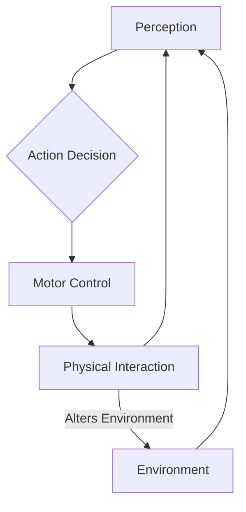

# Foundations of Physical AI and Embodied Intelligence

## Overview
This chapter introduces the fundamental concepts of Physical AI and embodied intelligence. We will explore how AI systems can interact with the physical world and the importance of embodiment for intelligent behavior.

## Learning Outcomes
- Understand the definition of Physical AI and embodied intelligence.
- Identify key differences between traditional AI and Physical AI.
- Recognize the challenges and opportunities in building embodied intelligent systems.
- Gain familiarity with initial concepts of robot interaction with the environment.

## Real-life example
Consider a robotic arm sorting objects on a conveyor belt. This seemingly simple task requires the robot to perceive the objects (using cameras), understand their properties (size, shape, material), plan grasping motions, and execute those motions with precision, all while interacting with the physical world. This is a prime example of Physical AI in action.

## Technical explanation with diagrams
The concept of embodied intelligence suggests that an intelligent agent's understanding and interaction with the world are deeply intertwined with its physical body and experiences.


*Figure 1: Simplified loop of embodied intelligence*

## Code examples (Python)
```python
# Placeholder for a simple Python code example related to sensor data processing
# e.g., a basic function to simulate reading a sensor and interpreting its value

def read_simulated_sensor_data():
    """Simulates reading data from a sensor."""
    import random
    return {"temperature": random.uniform(20.0, 30.0), "pressure": random.uniform(900.0, 1100.0)}

if __name__ == "__main__":
    sensor_data = read_simulated_sensor_data()
    print(f"Simulated sensor data: {sensor_data}")
    if sensor_data["temperature"] > 25:
        print("Temperature is high!")
    else:
        print("Temperature is normal.")
```

## Glossary
- **Physical AI**: Artificial intelligence systems designed to operate and interact directly within the physical world, often through robotic bodies.
- **Embodied Intelligence**: The concept that an intelligent agent's cognitive abilities are fundamentally shaped by its physical body, sensory experiences, and interactions with the environment.
- **Actuator**: A component of a machine that is responsible for moving or controlling a mechanism or system.
- **Sensor**: A device that detects and responds to some type of input from the physical environment.

## Quiz Questions
1. What is the primary distinction between traditional AI and Physical AI?
    a) Physical AI uses more complex algorithms.
    b) Traditional AI focuses on software, while Physical AI focuses on physical interaction.
    c) Physical AI is always embedded in a humanoid robot.
    d) Traditional AI does not learn.

2. Which of the following is NOT a characteristic of embodied intelligence?
    a) Cognition is influenced by physical form.
    b) Learning occurs through interaction with the environment.
    c) Intelligence is purely abstract and independent of the body.
    d) Sensory experiences are crucial for development.

3. Give an example of a real-world application of Physical AI.

4. How does a sensor contribute to a robot's ability to interact with its environment?

5. What is the role of an actuator in a robotic system?
