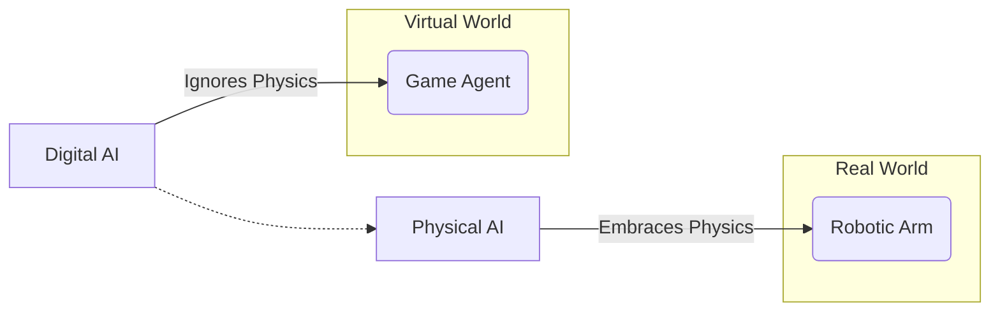

# From Digital AI to Robots that Understand Physical Laws

## Overview
This chapter explores the transition from purely digital AI, which operates on abstract data, to Physical AI, which must comprehend and abide by the laws of physics to effectively operate in the real world. We will discuss the critical role of physics in robotics and how simulation helps bridge this gap.

## Learning Outcomes
- Understand the limitations of digital AI in physical applications.
- Appreciate the importance of physics in robot design and control.
- Learn how physics engines and simulators model the real world.
- Differentiate between kinematic and dynamic models of a robot.

## Real-life example
A self-driving car must do more than just recognize a stop sign (digital perception); it must also understand the physics of braking. It needs to calculate the required braking force based on its speed, mass, road friction, and distance to the stop line. Misjudging these physical parameters can lead to accidents, highlighting why understanding physics is non-negotiable for Physical AI.

## Technical explanation with diagrams
The core challenge is embedding physical laws into a robot's decision-making process. This is often achieved through its model. A simple model might only consider the robot's geometry (kinematics), while a more complex one includes forces and torques (dynamics).


*Figure 1: High-level difference between digital and physical AI focus.*

## Code examples (Python)
```python
# Placeholder for a simple Python code example demonstrating a physical calculation.
# e.g., calculating projectile motion.

def calculate_projectile_trajectory(initial_velocity, launch_angle_deg, time):
    """
    Calculates the x and y position of a projectile at a given time.
    (Ignoring air resistance for simplicity)
    """
    import math
    
    g = 9.81  # Acceleration due to gravity (m/s^2)
    launch_angle_rad = math.radians(launch_angle_deg)
    
    x = initial_velocity * math.cos(launch_angle_rad) * time
    y = (initial_velocity * math.sin(launch_angle_rad) * time) - (0.5 * g * time**2)
    
    return {"x": x, "y": y}

if __name__ == "__main__":
    # Simulate trajectory for 1 second
    position = calculate_projectile_trajectory(initial_velocity=50, launch_angle_deg=30, time=1)
    print(f"Position at 1s: (x={position['x']:.2f}m, y={position['y']:.2f}m)")
    
    position_at_5s = calculate_projectile_trajectory(initial_velocity=50, launch_angle_deg=30, time=5)
    print(f"Position at 5s: (x={position_at_5s['x']:.2f}m, y={position_at_5s['y']:.2f}m)")
```

## Glossary
- **Physics Engine**: Software that performs physics simulations, calculating the effects of forces, collisions, and other physical properties.
- **Kinematics**: The study of motion without considering the forces that cause it. It describes the position, velocity, and acceleration of objects.
- **Dynamics**: The study of motion while considering the forces and torques that cause it.
- **Simulation**: The imitation of the operation of a real-world process or system over time.

## Quiz Questions
1. Why is a purely digital AI, like a chess program, insufficient for controlling a robot arm?
    a) Robot arms are not as complex as chess.
    b) The AI doesn't understand physical constraints like gravity, momentum, and friction.
    c) Chess programs cannot be written in Python.
    d) Digital AI cannot process camera images.

2. What is the main difference between kinematics and dynamics?
    a) Kinematics is for robots, dynamics is for cars.
    b) Kinematics studies motion, while dynamics studies the forces causing motion.
    c) Dynamics is a newer field than kinematics.
    d) There is no difference.

3. Name one reason why simulation is crucial for developing Physical AI.

4. If a robot knows all its joint angles to determine the position of its hand, is it using kinematics or dynamics?

5. What physical parameters might a self-driving car need to consider when braking?
