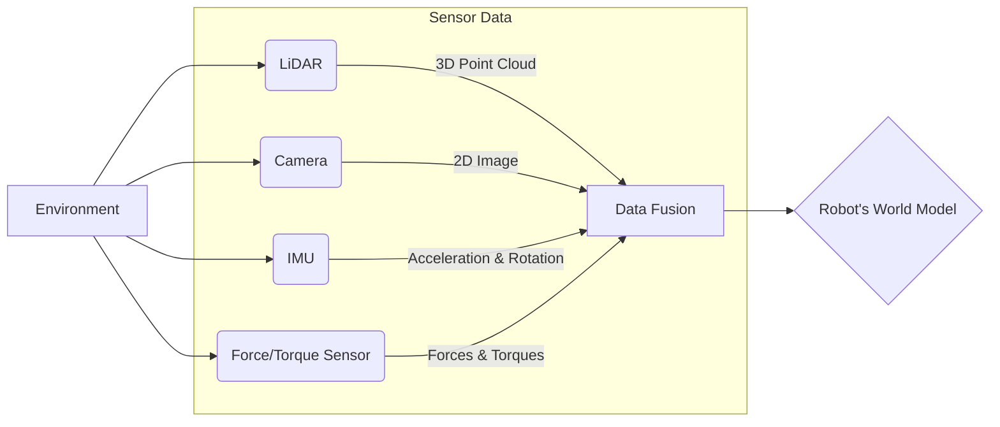

# Sensor Systems: LiDAR, Cameras, IMUs, Force/Torque

## Overview
This chapter provides an introduction to the critical sensor systems that enable robots to perceive and understand their environment. We will cover the principles and applications of four key sensor types: LiDAR, Cameras, Inertial Measurement Units (IMUs), and Force/Torque sensors.

## Learning Outcomes
- Understand the role of sensors in robotics.
- Describe the working principle of LiDAR and its use in mapping.
- Explain how cameras provide rich visual information.
- Define what an IMU is and how it helps with orientation and balance.
- Understand the function of Force/Torque sensors in manipulation tasks.

## Real-life example
A vacuum cleaning robot uses a suite of sensors to navigate a room. It might use LiDAR to create a map of the walls and furniture, cameras to identify small obstacles or dirt patches, an IMU to track its own movement and orientation, and bumper sensors (a simple form of force sensing) to detect collisions.

## Technical explanation with diagrams
Each sensor provides a different type of data about the world. Fusing this data together gives the robot a more complete and robust understanding of its environment.


*Figure 1: Data flow from multiple sensors to a unified world model.*

## Code examples (Python)
```python
# Placeholder for a Python code example demonstrating sensor data processing.
# e.g., a function to process a simplified LiDAR scan.

def process_lidar_scan(scan_data):
    """
    Processes a list of distances from a simulated LiDAR scan to find the closest object.
    """
    if not scan_data:
        return None, -1

    min_distance = min(scan_data)
    angle_of_min = scan_data.index(min_distance) # Assuming index corresponds to angle
    
    return min_distance, angle_of_min

if __name__ == "__main__":
    # Simulated 360-degree scan with one reading per degree
    # An object is very close at 90 degrees
    simulated_scan = [10.0] * 360
    simulated_scan[90] = 0.5 
    simulated_scan[89] = 0.7
    simulated_scan[91] = 0.7

    closest_dist, closest_angle = process_lidar_scan(simulated_scan)
    
    print(f"Closest object is at {closest_dist:.2f} meters, at an angle of {closest_angle} degrees.")
    if closest_dist < 1.0:
        print("Warning! Obstacle is very close.")
```

## Glossary
- **LiDAR (Light Detection and Ranging)**: A remote sensing method that uses light in the form of a pulsed laser to measure ranges (variable distances) to the Earth.
- **IMU (Inertial Measurement Unit)**: An electronic device that measures and reports a body's specific force, angular rate, and sometimes the magnetic field surrounding the body, using a combination of accelerometers, gyroscopes, and sometimes magnetometers.
- **Force/Torque Sensor**: A sensor that measures forces and torques applied to it. In robotics, it's often placed on a robot's wrist or gripper to "feel" interactions.
- **Data Fusion**: The process of integrating multiple data sources to produce more consistent, accurate, and useful information than that provided by any individual data source.

## Quiz Questions
1. Which sensor is best suited for creating a precise 2D or 3D map of a large room?
    a) IMU
    b) Camera
    c) LiDAR
    d) Force/Torque Sensor

2. What kind of information does an IMU primarily provide?
    a) Color and texture.
    b) Distances to objects.
    c) The robot's own motion and orientation.
    d) The weight of an object being lifted.

3. Why would you add a Force/Torque sensor to a robot's gripper?

4. What is a major advantage of using a camera as a sensor compared to LiDAR?

5. What is "sensor fusion" and why is it beneficial for a robot?
