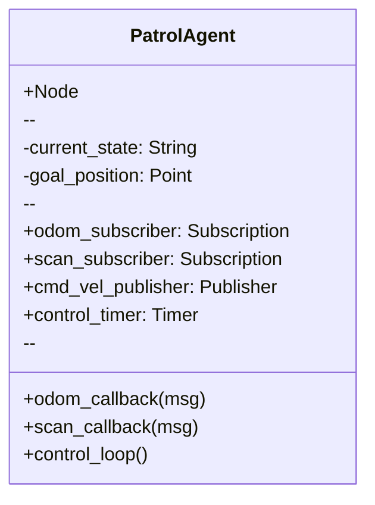

# Python Agents Integration using rclpy

## Overview
This chapter demonstrates how to build intelligent, agent-like behaviors in ROS 2 using the Python client library, `rclpy`. We'll move beyond simple publishers and subscribers to create nodes that can make decisions, manage state, and interact with the ROS 2 graph in a more sophisticated manner.

## Learning Outcomes
- Understand how to structure a ROS 2 node as a stateful agent.
- Use timers to create periodic agent behaviors.
- Combine publishers, subscribers, and services within a single class.
- Learn best practices for writing clean and maintainable ROS 2 Python code.

## Real-life example
Consider a patrol robot. Its "brain" can be a single Python agent (a ROS 2 node). This agent subscribes to `/odom` to know its position, subscribes to `/scan` to detect obstacles, and publishes to `/cmd_vel` to move. It maintains a state (e.g., "patrolling," "avoiding_obstacle," "returning_to_base") and uses a timer to periodically check its state and sensor data to decide what to do next.

## Technical explanation with diagrams
An "agent" in this context is a ROS 2 node, typically implemented as a Python class, that encapsulates a specific behavior. It maintains an internal state and uses ROS 2 communication patterns to perceive and act.


*Figure 1: Class diagram for a simple PatrolAgent, showing its components.*

## Code examples (Python/rclpy)
```python
# Placeholder for a stateful ROS 2 agent using rclpy

import rclpy
from rclpy.node import Node
from std_msgs.msg import String

class StateAgent(Node):

    def __init__(self):
        super().__init__('state_agent')
        # Agent's internal state
        self.state = 'listening'
        
        # This agent listens to a 'command' topic
        self.subscription = self.create_subscription(
            String,
            'command',
            self.command_callback,
            10)
        
        # This agent publishes its current state
        self.publisher_ = self.create_publisher(String, 'agent_status', 10)
        
        # A timer to run the agent's main loop
        self.timer = self.create_timer(1.0, self.agent_loop)

    def command_callback(self, msg):
        """Reacts to incoming commands."""
        self.get_logger().info(f'Received command: "{msg.data}"')
        if msg.data.lower() == 'work':
            self.state = 'working'
        elif msg.data.lower() == 'stop':
            self.state = 'listening'

    def agent_loop(self):
        """The agent's main decision loop."""
        status_msg = String()
        status_msg.data = f'Current state is: {self.state}'
        self.publisher_.publish(status_msg)
        self.get_logger().info(f'Publishing Status: "{status_msg.data}"')
        
        if self.state == 'working':
            # In a real agent, you would do work here
            self.get_logger().info('Doing some hard work...')

def main(args=None):
    rclpy.init(args=args)
    state_agent = StateAgent()
    rclpy.spin(state_agent)
    state_agent.destroy_node()
    rclpy.shutdown()

if __name__ == '__main__':
    main()
```

## Glossary
- **rclpy**: The official Python client library for ROS 2. It provides the necessary modules to create nodes, publishers, subscribers, etc., using Python.
- **State Machine**: A mathematical model of computation. An agent's logic can often be modeled as a state machine, where it transitions between states based on inputs.
- **Callback**: A function that is passed as an argument to another function and is executed after some event has occurred. In ROS 2, callbacks are used to handle incoming messages or timer events.

## Quiz Questions
1. In `rclpy`, what is the primary purpose of a `Node` class?
    a) To define a new message type.
    b) To encapsulate all the ROS 2 communications and logic for a specific process.
    c) To store global parameters.
    d) To launch other nodes.

2. Why is a timer a useful tool for creating an agent's main loop?
    a) It allows the agent to perform actions periodically, independent of message arrival.
    b) It is the only way to publish messages.
    c) It makes the code run faster.
    d) It is required for all subscribers.

3. In the context of a ROS 2 agent, what is "state"?

4. How can a single Python agent listen to multiple topics?

5. What is the function `rclpy.spin()` used for?
