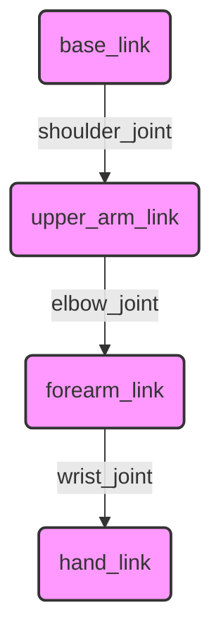

# URDF for Humanoids

## Overview
This chapter introduces the Unified Robot Description Format (URDF), the standard way to describe a robot's physical structure in ROS. We will learn how to define a robot's links (body parts) and joints (connections) in an XML-based format, focusing on how this applies to complex humanoid robots.

## Learning Outcomes
- Understand the purpose and syntax of URDF.
- Define a robot's structure using `<link>` and `<joint>` tags.
- Differentiate between various joint types (e.g., `revolute`, `continuous`, `fixed`).
- Apply URDF to model a simple humanoid arm.

## Real-life example
Every robot you see in ROS-based simulations, from the TurtleBot to advanced humanoids like Atlas, has a URDF file that defines its physical form. This file tells the simulator (like Gazebo) and visualization tools (like RViz) how the robot is constructed, allowing them to accurately display and simulate its motion.

## Technical explanation with diagrams
A URDF file describes a robot as a tree of links connected by joints. Each `<link>` has inertial, visual, and collision properties. Each `<joint>` defines the motion between two links.


*Figure 1: A simple URDF tree for a robotic arm. Each box is a `<link>` and each arrow represents a `<joint>`.*

## Code examples (URDF/XML)
```xml
<!-- Placeholder for a simple URDF snippet of a two-link arm -->

<robot name="simple_arm">

  <!-- Base Link -->
  <link name="base_link">
    <visual>
      <geometry>
        <cylinder length="0.2" radius="0.1"/>
      </geometry>
    </visual>
  </link>

  <!-- Joint between base and arm -->
  <joint name="shoulder_joint" type="revolute">
    <parent link="base_link"/>
    <child link="arm_link"/>
    <origin xyz="0 0 0.1"/>
    <axis xyz="0 1 0"/>
    <limit effort="300" velocity="1.0" lower="-1.57" upper="1.57" />
  </joint>

  <!-- Arm Link -->
  <link name="arm_link">
    <visual>
      <geometry>
        <box size="0.5 0.1 0.1"/>
      </geometry>
    </visual>
  </link>

</robot>
```

## Glossary
- **URDF (Unified Robot Description Format)**: An XML format for representing a robot model in ROS.
- **Link**: A rigid part of a robot's body. In URDF, it has visual, collision, and inertial properties.
- **Joint**: A connection between two links that defines how they can move relative to each other (e.g., rotate or slide).
- **RViz**: A 3D visualization tool for ROS that can display robot models, sensor data, and more.

## Quiz Questions
1. What does URDF stand for?
    a) Unified Robot Design Format
    b) Universal Robotic Description File
    c) Unified Robot Description Format
    d) Universal Robot Design File

2. In a URDF file, what is the primary purpose of the `<joint>` tag?
    a) To define the visual appearance of a robot part.
    b) To describe the connection and motion between two links.
    c) To specify the robot's sensor a.
    d) To set the color of the robot model.

3. What is the difference between a `revolute` and a `prismatic` joint?

4. Is a URDF file typically used to describe a robot's behavior or its physical structure?

5. Can a single link be a child in multiple joints?
