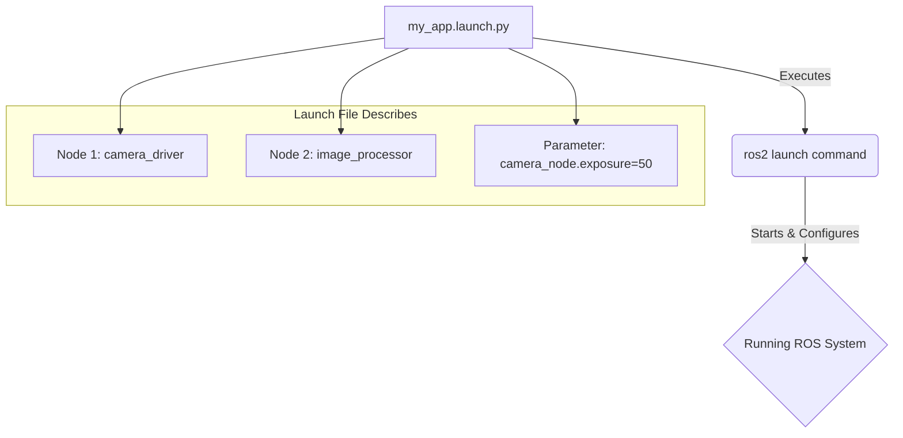

# Launch Files and Parameter Management

## Overview
This chapter covers two essential tools for managing complex ROS 2 systems: Launch files and Parameters. Launch files allow you to start up multiple nodes (and configure them) with a single command. Parameters provide a way to configure nodes externally without changing their code.

## Learning Outcomes
- Understand the benefits of using launch files.
- Write a simple launch file in Python to start one or more nodes.
- Learn how to pass parameters to a node from a launch file.
- Use `ros2 param` to inspect and change node parameters at runtime.

## Real-life example
Starting a self-driving car's software stack might involve launching 20-30 nodes (camera drivers, LiDAR drivers, perception nodes, planning nodes, control nodes, etc.). Doing this manually one-by-one in separate terminals would be impossible. Instead, a single main launch file, e.g., `ros2 launch car_bringup car.launch.py`, is used to start and configure the entire system.

## Technical explanation with diagrams
A ROS 2 launch file is a Python script that describes how to run a set of nodes. You can specify which nodes to start, remap their topic names, and set their initial parameter values.


*Figure 1: How a launch file is used to start a configured ROS 2 system.*

## Code examples (Python Launch File)
```python
# Placeholder for a simple Python launch file

from launch import LaunchDescription
from launch_ros.actions import Node

def generate_launch_description():
    return LaunchDescription([
        # Start a talker node
        Node(
            package='demo_nodes_py',
            executable='talker',
            name='my_talker',
            parameters=[
                {'my_param': 'hello'}
            ]
        ),
        # Start a listener node
        Node(
            package='demo_nodes_py',
            executable='listener',
            name='my_listener'
        )
    ])
```

## Glossary
- **Launch File**: A file (typically in Python) that specifies a collection of nodes to be run, along with their configurations.
- **Parameter**: A configurable value that a node can use. Parameters can be set at startup (via a launch file) or changed during runtime.
- **`ros2 launch`**: The command-line tool used to execute a launch file.
- **`ros2 param`**: The command-line tool used to interact with the parameters of a running node.

## Quiz Questions
1. What is the primary advantage of using a launch file?
    a) It makes individual nodes run faster.
    b) It allows you to start and configure multiple nodes with one command.
    c) It automatically writes your node's source code.
    d) It is the only way to use parameters.

2. In a Python launch file, what class is commonly used to specify a node to be run?
    a) `launch.Node`
    b) `ros.Node`
    c) `launch_ros.actions.Node`
    d) `rclpy.node.Node`

3. What command would you use to see the current value of a parameter on a running node?

4. Can parameters be changed while a node is running? If so, how?

5. Besides starting nodes, what other common action can be performed in a launch file?
