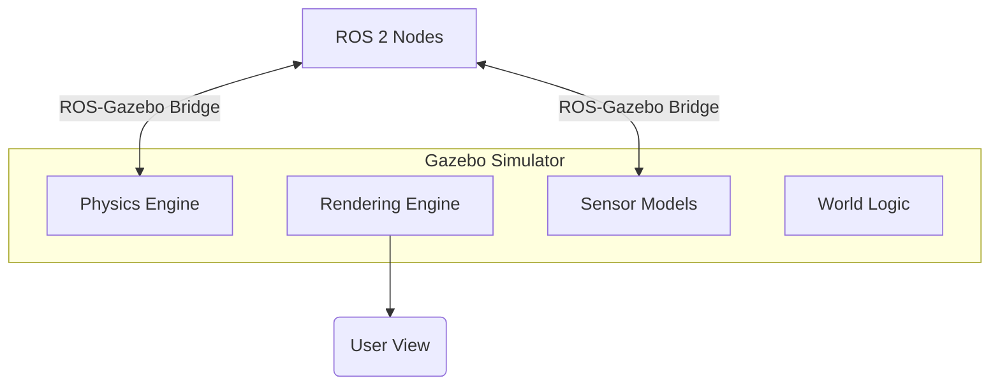

# Physics Simulation and Environment Setup

## Overview
This chapter introduces the world of robotics simulation, focusing on why it's a cornerstone of modern robotics development. We'll discuss the role of physics engines and how to set up a basic simulation environment in Gazebo, one of the most popular open-source simulators for robotics.

## Learning Outcomes
- Understand the benefits of simulation in robotics (cost, speed, safety).
- Learn about the role of a physics engine (e.g., ODE, DART, Bullet).
- Get familiar with the Gazebo simulator interface.
- Learn how to add simple objects and build a basic world environment.

## Real-life example
Before a Mars rover is built and launched, its design is tested extensively in a simulated Martian environment. Engineers create a "digital twin" of the rover and the terrain to test its mobility over rocks, its ability to collect samples, and its resilience to dust storms, all from the safety and low cost of a computer simulation.

## Technical explanation with diagrams
A simulator combines a physics engine with a rendering engine. The physics engine computes the motion and interaction of objects, while the rendering engine displays the world visually. ROS 2 integrates seamlessly with simulators like Gazebo.


*Figure 1: High-level architecture of Gazebo and its interaction with ROS 2.*

## Code examples (Gazebo World SDF)
```xml
<!-- Placeholder for a simple Gazebo world file (.sdf) -->

<sdf version='1.7'>
  <world name='default'>
    <!-- A ground plane -->
    <include>
      <uri>model://ground_plane</uri>
    </include>

    <!-- A sun for lighting -->
    <include>
      <uri>model://sun</uri>
    </include>

    <!-- A simple box -->
    <model name='unit_box'>
      <pose>0 2 0.5 0 0 0</pose>
      <link name='link'>
        <inertial>
          <mass>1.0</mass>
        </inertial>
        <collision name='collision'>
          <geometry>
            <box>
              <size>1 1 1</size>
            </box>
          </geometry>
        </collision>
        <visual name='visual'>
          <geometry>
            <box>
              <size>1 1 1</size>
            </box>
          </geometry>
        </visual>
      </link>
    </model>
  </world>
</sdf>
```

## Glossary
- **Gazebo**: A powerful open-source 3D robotics simulator.
- **Digital Twin**: A virtual model of a physical object or system.
- **SDF (Simulation Description Format)**: An XML format used by Gazebo to describe everything about a simulation, including robots, environments, and physics.
- **Physics Engine**: Software that simulates physical systems, such as rigid body dynamics, fluid dynamics, and collisions.

## Quiz Questions
1. Which of the following is a primary benefit of using simulation in robotics?
    a) It's always more accurate than the real world.
    b) It allows for safe, fast, and low-cost testing.
    c) It eliminates the need for any real-world hardware.
    d) Simulators require no programming.

2. What is the role of a "physics engine" in a simulator?
    a) To make the simulation look photorealistic.
    b) To calculate the movement and interaction of objects based on physical laws.
    c) To provide an interface for ROS 2.
    d) To record video of the simulation.

3. What does SDF stand for, and what is it used for in Gazebo?

4. What is a "digital twin"?

5. Can you add a robot defined in URDF into a Gazebo simulation?
