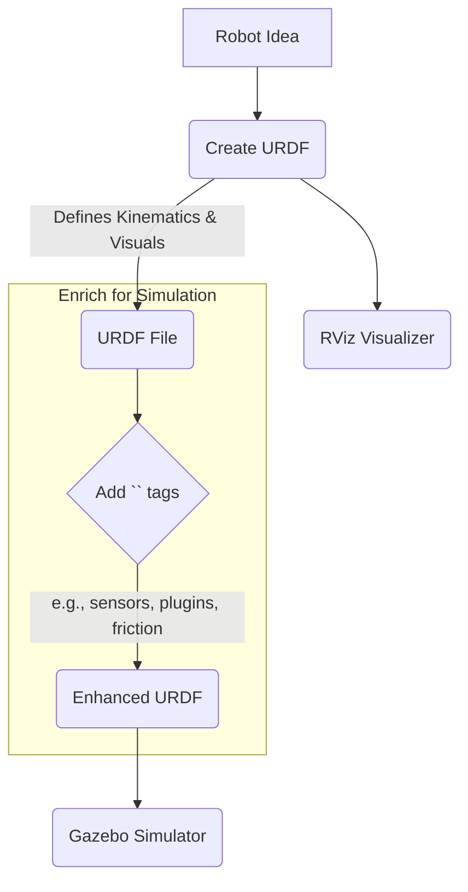

# URDF & SDF Robot Description

## Overview
In this chapter, we dive deeper into robot descriptions for simulation. While URDF is great for describing the kinematics and visual appearance of a robot, Gazebo often uses its native Simulation Description Format (SDF) to add more detail, such as physics properties, sensor definitions, and plugin attachments. We will learn the relationship between URDF and SDF and how to use them together.

## Learning Outcomes
- Understand the limitations of URDF for simulation.
- Learn the basic structure of SDF.
- Know how to convert a URDF to SDF.
- Add Gazebo-specific tags to a URDF to control simulation properties.

## Real-life example
When you use a robot model in Gazebo, you are almost always using SDF, even if you started with a URDF. The ROS 2 launch system often converts the URDF to SDF on the fly, adding the necessary simulation-specific information. For example, a URDF might define a wheel's shape, but the SDF (or Gazebo-specific URDF tags) will define its friction coefficients and the plugin needed to make it spin.

## Technical explanation with diagrams
SDF is a superset of URDF. It can describe everything URDF can, plus environments, physics, lighting, and more. While you can write SDF directly, a common workflow is to enhance a URDF file with special `<gazebo>` tags.


*Figure 1: Workflow showing how a base URDF is used by RViz and enhanced for Gazebo.*

## Code examples (SDF snippet in URDF)
```xml
<!-- Placeholder for a URDF with a Gazebo extension tag -->

<robot name="simple_car">

  <!-- ... (rest of the URDF for links and joints) ... -->
  
  <link name="left_wheel_link">
    <!-- ... (visual and collision) ... -->
  </link>
  
  <!-- Add Gazebo-specific properties for the wheel link -->
  <gazebo reference="left_wheel_link">
    <mu1>1.0</mu1>
    <mu2>1.0</mu2>
    <material>Gazebo/Grey</material>
  </gazebo>
  
  <!-- Add a Gazebo plugin to control the robot -->
  <gazebo>
    <plugin name="differential_drive_controller" filename="libgazebo_ros_diff_drive.so">
      <!-- Plugin parameters go here -->
      <left_joint>left_wheel_joint</left_joint>
      <right_joint>right_wheel_joint</right_joint>
      <wheel_separation>0.4</wheel_separation>
      <wheel_diameter>0.2</wheel_diameter>
      <robot_base_frame>base_link</robot_base_frame>
      <command_topic>cmd_vel</command_topic>
      <odometry_topic>odom</odometry_topic>
    </plugin>
  </gazebo>

</robot>
```

## Glossary
- **SDF (Simulation Description Format)**: A complete XML format for describing objects and environments for robot simulators, especially Gazebo.
- **URDF (Unified Robot Description Format)**: An XML format for representing a robot model, primarily its kinematic and visual properties.
- **Plugin**: A piece of custom code (usually a C++ shared library) that can be loaded by Gazebo to add new functionality, such as a new sensor model or a robot controller.

## Quiz Questions
1. What is a key advantage of SDF over URDF for simulation?
    a) SDF files are always shorter.
    b) SDF can describe physics and sensors, while URDF primarily describes kinematics.
    c) URDF is not an XML format.
    d) Only SDF can be used to define a robot's color.

2. What is the purpose of the `<gazebo>` tag when used inside a URDF file?
    a) It tells RViz to ignore this part of the file.
    b) It contains comments that are not parsed.
    c) It adds simulation-specific information that only Gazebo understands.
    d) It links to an external SDF file.

3. Can Gazebo use a pure URDF file without any SDF or `<gazebo>` tags?

4. What is a Gazebo "plugin" used for?

5. If SDF is a superset of URDF, why do people still use URDF?
