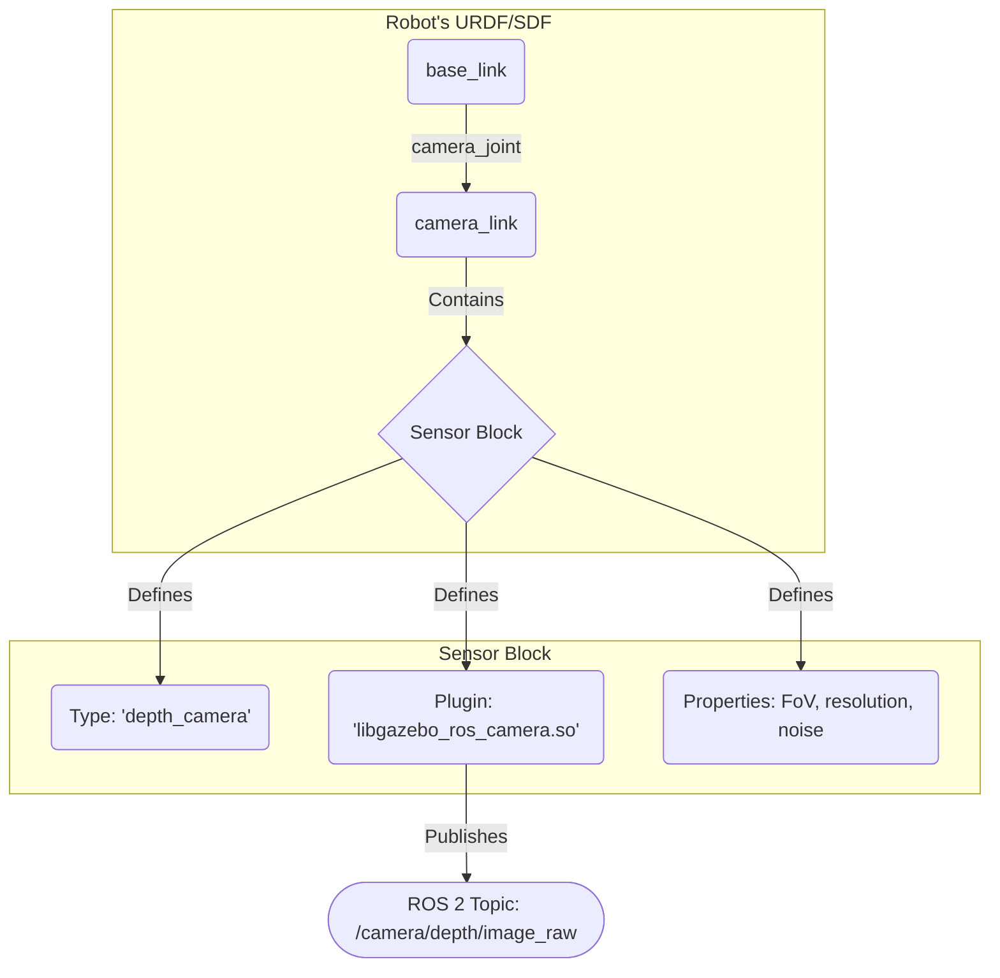

# Sensor Simulation (LiDAR, Depth Cameras, IMUs)

## Overview
This chapter focuses on how to add and configure simulated sensors on a robot model in Gazebo. Accurate sensor simulation is key to developing and testing perception and control algorithms before deploying them on a physical robot. We will cover how to simulate three of the most common sensor types: LiDAR, depth cameras, and IMUs.

## Learning Outcomes
- Understand how Gazebo simulates sensor data.
- Add a LiDAR sensor to a URDF/SDF model and configure its properties.
- Add a depth camera and understand its data output.
- Add an IMU to track the robot's orientation and acceleration.

## Real-life example
To test a self-driving car's emergency braking system, you need to simulate a pedestrian stepping into the road. This requires a simulated world with a pedestrian model and a simulated car with sensors (like LiDAR and cameras) that can "see" the pedestrian. The sensor plugins in Gazebo generate the exact same type of data messages that a real sensor would, so the car's perception software doesn't know the difference.

## Technical explanation with diagrams
Sensors are added to a robot model in SDF (or using `<gazebo>` tags in URDF) by attaching a `<sensor>` block to a link. The sensor's properties (like range, field of view, noise) and its corresponding plugin are defined within this block. The plugin is responsible for generating the sensor data and publishing it to a ROS 2 topic.


*Figure 1: How a simulated camera is defined in SDF and publishes data to ROS 2.*

## Code examples (SDF for a Camera Sensor)
```xml
<!-- Placeholder for an SDF snippet to add a camera sensor -->

<gazebo reference="camera_link">
  <sensor type="camera" name="my_camera_sensor">
    <update_rate>30.0</update_rate>
    <camera name="head">
      <horizontal_fov>1.39626</horizontal_fov>
      <image>
        <width>800</width>
        <height>800</height>
        <format>R8G8B8</format>
      </image>
      <clip>
        <near>0.02</near>
        <far>300</far>
      </clip>
    </camera>
    <plugin name="camera_controller" filename="libgazebo_ros_camera.so">
      <ros>
        <namespace>my_robot</namespace>
        <remapping>image_raw:=color/image_raw</remapping>
        <remapping>camera_info:=color/camera_info</remapping>
      </ros>
    </plugin>
  </sensor>
</gazebo>
```

## Glossary
- **Sensor Plugin**: A specific type of Gazebo plugin that simulates a sensor. It generates sensor data and typically publishes it to a ROS 2 topic.
- **Depth Camera**: A camera that provides distance information for each pixel, creating a "depth image".
- **Noise Model**: A mathematical model added to simulated sensor data to make it more realistic by mimicking the imperfections and random errors of real-world sensors.

## Quiz Questions
1. Why is it important to simulate sensors?
    a) Real sensors are too expensive to buy.
    b) To test perception and control algorithms without needing a physical robot.
    c) Simulated sensors are always perfectly accurate.
    d) It is a requirement for all ROS 2 packages.

2. In Gazebo's SDF, what does a sensor "plugin" do?
    a) It defines the visual look of the sensor.
    b) It calculates the physics of the sensor itself.
    c) It generates the sensor data and publishes it over ROS 2.
    d) It defines the sensor's warranty information.

3. What kind of data does a simulated LiDAR sensor typically publish?

4. How can you make a simulated sensor's output more realistic?

5. If you add a camera sensor to your robot in Gazebo, how do your ROS 2 nodes access the image data it produces?
