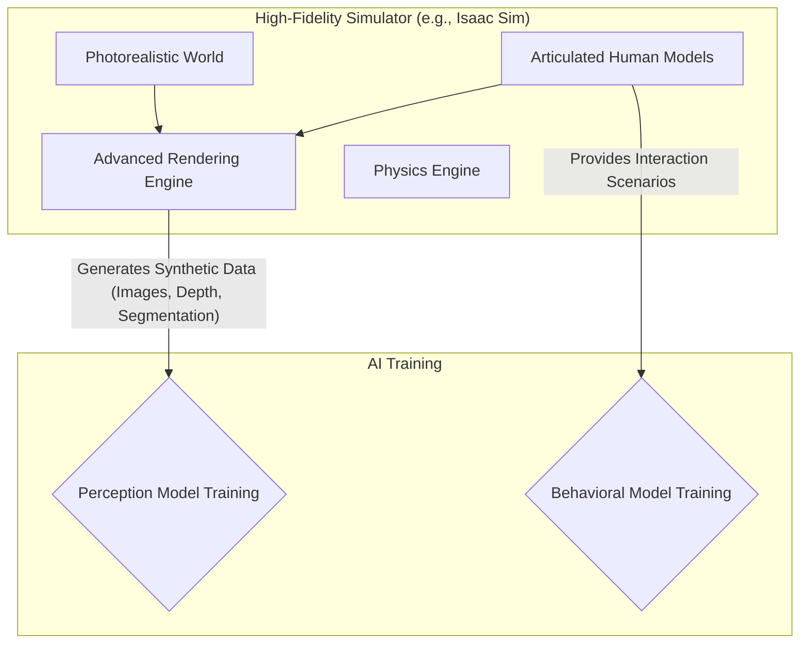

# High-Fidelity Rendering & Human-Robot Interaction

## Overview
While Gazebo is a powerful tool for physics simulation, other simulators excel at creating photorealistic, high-fidelity graphics. This chapter provides an overview of using simulators like NVIDIA Isaac Sim or game engines like Unity for advanced visualization. We'll also discuss how these environments are used to simulate complex human-robot interaction (HRI) scenarios.

## Learning Outcomes
- Understand the difference between a physics-focused and a rendering-focused simulator.
- Recognize the benefits of high-fidelity rendering for developing AI models (e.g., synthetic data generation).
- Learn about simulators designed for photorealism, such as NVIDIA Isaac Sim.
- Understand the challenges and importance of simulating humans for HRI research.

## Real-life example
To train a robot to work alongside people in a warehouse, you need data of the robot operating in many different situations with many different people. Gathering this data in the real world is slow, expensive, and potentially dangerous. By using a high-fidelity simulator, developers can create a virtual warehouse, populate it with realistic digital humans, and generate vast amounts of "synthetic data" to train the robot's AI safely and efficiently.

## Technical explanation with diagrams
High-fidelity simulators use advanced rendering techniques like ray tracing and physically-based rendering (PBR) to create images that are nearly indistinguishable from reality. They also often include sophisticated tools for creating realistic animations and behaviors for virtual humans.


*Figure 1: Using a high-fidelity simulator to generate synthetic data and scenarios for AI training.*

## Code examples
*(This section would typically contain examples using the specific Python APIs of simulators like Isaac Sim. As these are highly specific, we'll use a conceptual placeholder.)*
```python
# Conceptual placeholder for an Isaac Sim Python script

# Import the necessary simulation library
from isaacsim import SimulationApp

# Configuration for the simulation
config = {"renderer": "RayTracedLighting"}
app = SimulationApp(config)

# Load a virtual environment (e.g., a warehouse)
simulation.load_environment("omniverse://localhost/Projects/warehouse.usd")

# Add a robot to the scene
robot = simulation.add_robot(urdf_path="my_robot.urdf", position=(0, 0, 0))

# Add an animated human model to the scene
human = simulation.add_character(asset_path="human_worker.usd", position=(5, 3, 0))
human.play_animation("walking")

# Run the simulation
while app.is_running():
    simulation.step()
    
    # In a real script, you would capture sensor data here
    # camera_data = robot.get_camera("front_camera").get_image()
    # save_image(camera_data)

app.close()
```

## Glossary
- **High-Fidelity Rendering**: The process of creating computer-generated images that are highly realistic, often aiming for photorealism.
- **Synthetic Data**: Artificially generated data that is used to train and test AI models.
- **Human-Robot Interaction (HRI)**: A field of study dedicated to understanding, designing, and evaluating robotic systems for use by or with humans.
- **Physically-Based Rendering (PBR)**: A computer graphics approach that seeks to render graphics in a way that more accurately models the flow of light in the real world.

## Quiz Questions
1. What is a primary advantage of using a high-fidelity simulator like Isaac Sim over a standard one like Gazebo?
    a) The physics are always more accurate.
    b) They can generate photorealistic images, which is good for training vision-based AI.
    c) They are always open-source.
    d) They run on less powerful computers.

2. What is "synthetic data"?
    a) Data that has been proven to be false.
    b) Data generated by a computer simulation rather than collected from the real world.
    c) Data that is encrypted.
    d) Data about sensors.

3. Why is simulating humans important for HRI research?

4. What is Physically-Based Rendering (PBR)?

5. Besides training AI, what is another reason a company might want a photorealistic "digital twin" of its robot and factory?
