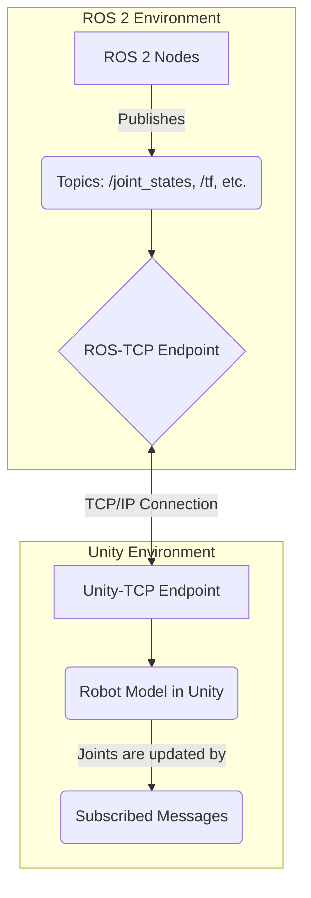

# Unity Visualization Basics

## Overview
This chapter provides a basic introduction to using Unity, a popular real-time development platform (game engine), for robotics visualization. While Gazebo and Isaac Sim are dedicated robotics simulators, Unity's powerful rendering capabilities, cross-platform support, and rich asset ecosystem make it an excellent choice for creating compelling 3D visualizations and user interfaces for robots.

## Learning Outcomes
- Understand why a game engine like Unity can be useful for robotics.
- Get familiar with the basic Unity editor layout (Scene view, Hierarchy, Inspector).
- Learn how to import a robot model (e.g., as an FBX file) into Unity.
- Understand the concept of using a ROS-Unity integration tool to link your ROS 2 system to the Unity visualization.

## Real-life example
A company wants to create a public demo of its new humanoid robot. Instead of a simple simulation video, they use Unity to create a polished, interactive application. Users can view the robot in a beautifully rendered virtual showroom, trigger different animations (like waving or dancing), and see real-time sensor data visualized as dynamic overlays. This application connects to the live ROS 2 system running the actual robot or a high-fidelity simulation.

## Technical explanation with diagrams
The key to using Unity for robotics is the bridge that connects it to your ROS 2 graph. Packages like `ROS-TCP-Connector` create a TCP/IP connection between the ROS 2 environment and the Unity environment, allowing them to exchange ROS messages. Unity can then subscribe to topics (like `/joint_states` or `/tf`) to animate the robot model in sync with the real or simulated robot.


*Figure 1: Architecture of a ROS-Unity integration.*

## Code examples (C# in Unity)
```csharp
// Conceptual placeholder for a Unity C# script to subscribe to a ROS topic

using UnityEngine;
using Unity.Robotics.ROSTCPConnector;
using RosMessageTypes.Std; // Assuming you have generated message types

public class SimpleSubscriber : MonoBehaviour
{
    void Start()
    {
        // Get the ROS connection instance
        ROSConnection.GetOrCreateInstance().Subscribe<StringMsg>("chatter", ChatterCallback);
    }

    // Callback function to be executed when a message is received
    void ChatterCallback(StringMsg message)
    {
        // Log the message data to the Unity console
        Debug.Log("Message from ROS: " + message.data);
    }
}
```

## Glossary
- **Unity**: A popular cross-platform game engine developed by Unity Technologies.
- **Game Engine**: A software framework designed for the creation and development of video games, which often includes rendering, physics, and scripting capabilities.
- **Asset**: A resource used in a Unity project, such as a 3D model, a texture, a sound file, or a script.
- **ROS-TCP-Connector**: A set of open-source packages from Unity that enable communication between a Unity application and a ROS environment.

## Quiz Questions
1. Which of these is a primary reason to use Unity for robotics visualization?
    a) It is the only way to run ROS 2 nodes.
    b) It provides industry-leading physics simulation for robotics.
    c) It has a powerful rendering engine and a large ecosystem of assets for creating polished visuals.
    d) It is the official simulator for ROS 2.

2. In the context of Unity, what is an "Asset"?
    a) A bug in the code.
    b) A resource used in the project, like a 3D model or a script.
    c) A subscription to a ROS 2 topic.
    d) The final compiled application.

3. How does a Unity visualization typically get information about a robot's joint positions from a ROS 2 system?

4. Is Unity a dedicated robotics simulator like Gazebo?

5. What is the name of the Unity-developed package that helps connect Unity to a ROS environment?
