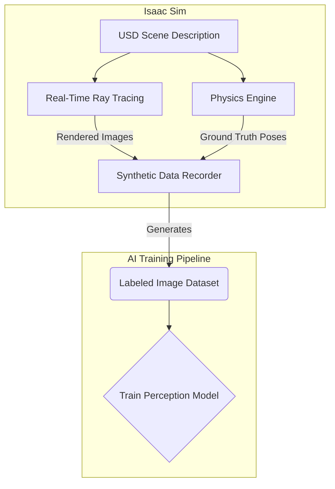

# Isaac Sim: Photorealistic Simulation, Synthetic Data

## Overview
This chapter introduces NVIDIA Isaac Sim, a powerful robotics simulation platform built on NVIDIA Omniverse. We will explore its key features, including high-fidelity, physically-based rendering, and its powerful capabilities for generating synthetic data to train AI perception models.

## Learning Outcomes
- Understand what NVIDIA Isaac Sim is and its relationship to Omniverse.
- Recognize the advantages of photorealistic simulation for robotics AI.
- Learn about Synthetic Data Generation (SDG) and why it's a game-changer.
- Differentiate Isaac Sim from other simulators like Gazebo.

## Real-life example
A company is developing an AI-powered robot to sort fruit. To train the robot's vision system to recognize apples, bananas, and oranges, they need thousands of labeled images. Instead of taking pictures manually, they use Isaac Sim to generate 100,000 photorealistic images of fruit in various lighting conditions, orientations, and backgrounds. This "synthetic data" is then used to train a robust perception model before the robot is even built.

## Technical explanation with diagrams
Isaac Sim leverages NVIDIA's Omniverse platform, which uses the Universal Scene Description (USD) format to describe complex 3D scenes. Its real-time ray tracing and path tracing capabilities produce stunningly realistic visuals. The built-in synthetic data generation tools can automatically create labeled datasets for object detection, segmentation, and more.


*Figure 1: Synthetic data generation workflow in Isaac Sim.*

## Code examples (Isaac Sim Python API)
```python
# Conceptual placeholder for an Isaac Sim SDG script

from omni.isaac.core import World
from omni.isaac.synthetic_utils import SyntheticDataHelper

# Initialize the simulation world
world = World()
world.scene.add_default_ground_plane()

# Add objects to the scene
world.scene.add(
    Prim(prim_path="/World/MyCube", prim_type="Cube", position=(0, 0, 1.0))
)

# Initialize the synthetic data helper
sdh = SyntheticDataHelper()

# Initialize a writer to save the data
writer = sdh.get_writer("MyWriter", "path/to/output")
writer.initialize(
    output_types=["rgb", "bounding_box_2d_tight"], 
    viewport_name="DefaultViewport"
)

# Run the simulation for a few frames to generate data
for i in range(10):
    world.step()
    writer.write_data()

world.stop()
```

## Glossary
- **NVIDIA Isaac Sim**: A scalable robotics simulation application and synthetic data generation tool that powers AI-based robotics.
- **NVIDIA Omniverse**: A real-time 3D collaboration and simulation platform.
- **USD (Universal Scene Description)**: A file format developed by Pixar for robustly and scalably interchanging 3D scene data.
- **Synthetic Data Generation (SDG)**: The process of using simulation to create large, labeled datasets for training AI models.

## Quiz Questions
1. What platform is NVIDIA Isaac Sim built on?
    a) ROS
    b) Gazebo
    c) NVIDIA Omniverse
    d) Unity

2. What is a primary use case for the photorealistic rendering in Isaac Sim?
    a) To make cool-looking videos.
    b) To generate synthetic data for training AI vision models.
    c) To ensure the physics are 100% accurate.
    d) To run the simulation on older computers.

3. What does USD stand for and which company originally developed it?

4. Why is synthetic data often preferred over real-world data for training perception models?

5. Besides RGB images, what other types of data can a synthetic data generator typically create?
