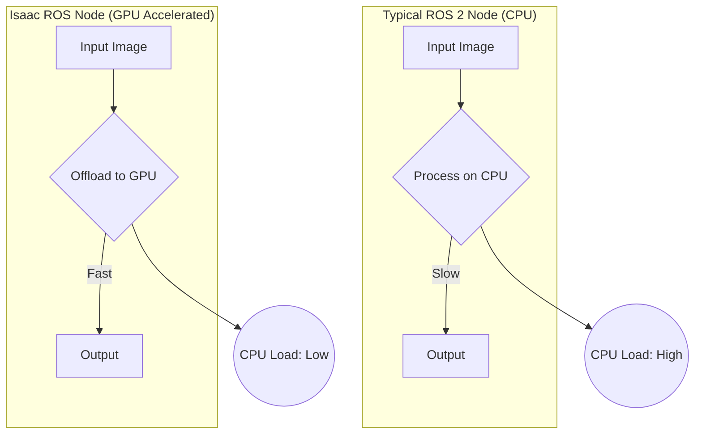

# Isaac ROS: VSLAM, Hardware Acceleration

## Overview
This chapter introduces the Isaac ROS collection, a set of high-performance ROS 2 packages optimized for the NVIDIA Jetson platform and GPU-powered workstations. We will explore how these packages leverage hardware acceleration to perform computationally intensive tasks like Visual SLAM (VSLAM) in real-time.

## Learning Outcomes
- Understand what Isaac ROS is and how it fits into the ROS 2 ecosystem.
- Learn about hardware acceleration and its importance for real-time robotics.
- Understand the concept of VSLAM (Visual Simultaneous Localization and Mapping).
- Identify key Isaac ROS packages for perception and navigation.

## Real-life example
An autonomous drone needs to navigate inside a warehouse where GPS is unavailable. It uses a stereo camera and the Isaac ROS VSLAM package running on an NVIDIA Jetson module. The VSLAM algorithm processes the stereo images at high speed, using the GPU to simultaneously build a map of the environment and track the drone's position within it, all in real-time.

## Technical explanation with diagrams
Isaac ROS packages are built on top of NVIDIA's performance-tuned libraries (like CUDA, TensorRT, and VPI). They expose this high-performance functionality as standard ROS 2 nodes. This allows a ROS 2 application to offload heavy computations to the GPU, freeing up the CPU for other tasks.


*Figure 1: Comparison of CPU vs. GPU accelerated processing in ROS 2.*

## Code examples (Shell/Terminal)
```bash
# Conceptual placeholder for running an Isaac ROS VSLAM node

# 1. First, run the Isaac Sim simulation or a real robot with a stereo camera
# This will be publishing stereo images to ROS 2 topics.
# e.g., /left/image_raw, /right/image_raw

# 2. In a new terminal, launch the Isaac ROS VSLAM node
ros2 launch isaac_ros_vslam isaac_ros_vslam.launch.py

# 3. The VSLAM node subscribes to the image topics and starts publishing
#    the robot's pose, a point cloud map, and other visualization data.

# 4. In another terminal, launch RViz to view the output
ros2 launch isaac_ros_vslam rviz_isaac_ros_vslam.launch.py

```

## Glossary
- **Isaac ROS**: A collection of hardware-accelerated ROS 2 packages for perception, navigation, and manipulation.
- **Hardware Acceleration**: The use of specialized hardware (like a GPU) to perform specific tasks more efficiently than is possible in software running on a general-purpose CPU.
- **VSLAM (Visual Simultaneous Localization and Mapping)**: An algorithm that uses input from a camera to build a map of an unknown environment while simultaneously tracking the camera's location within that map.
- **NVIDIA Jetson**: A series of embedded computing boards from NVIDIA, designed to bring GPU-accelerated computing to edge devices.

## Quiz Questions
1. What is the main benefit of using Isaac ROS packages?
    a) They are written in a simpler programming language.
    b) They provide hardware-accelerated performance for common robotics tasks.
    c) They only work in simulation.
    d) They replace the need for `rclpy`.

2. What does VSLAM stand for?
    a) Very Speedy Localization and Mapping
    b) Visual Simultaneous Localization and Mapping
    c) Volumetric Sensor and Lidar Mapping
    d) Visual Service and Location Manager

3. What kind of hardware is typically used for acceleration in Isaac ROS?

4. Why is hardware acceleration important for a task like VSLAM on a mobile robot?

5. Are Isaac ROS packages standard ROS 2 packages? Can they be mixed with other non-accelerated ROS 2 packages?
