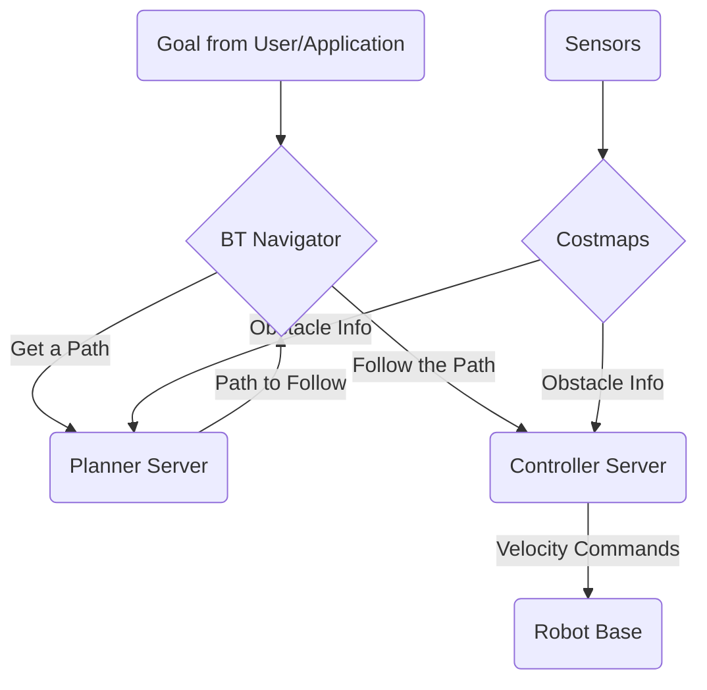

# Path Planning with Nav2

## Overview
This chapter explores Nav2, the second generation of the ROS Navigation Stack. Nav2 is a powerful, production-quality framework for mobile robot navigation, enabling a robot to move from point A to point B while avoiding obstacles. We will discuss its core components and how it integrates with other ROS 2 systems.

## Learning Outcomes
- Understand the purpose and high-level architecture of Nav2.
- Differentiate between global planning and local planning.
- Learn about the role of costmaps in navigation.
- Understand how to send a navigation goal to Nav2.

## Real-life example
A hospital delivery robot needs to transport medicine from the pharmacy on the 1st floor to a patient's room on the 3rd floor. It uses Nav2 to accomplish this. Given a map of the hospital and a goal location, Nav2's global planner finds the optimal route (e.g., down the hall, to the elevator, etc.). As the robot moves, its local planner constantly adjusts the path to avoid temporary obstacles like people or hospital carts, using real-time data from its laser scanners.

## Technical explanation with diagrams
Nav2 operates using a "stack" of specialized servers (ROS 2 nodes) that handle different parts of the navigation problem. The BT Navigator coordinates everything, using a Behavior Tree to switch between tasks like planning a path, following the path, and recovering from errors.


*Figure 1: Simplified architecture of the Nav2 stack.*

## Code examples (Python/rclpy)
```python
# Conceptual placeholder for sending a navigation goal in Python

from action_msgs.msg import GoalStatus
from geometry_msgs.msg import PoseStamped
from nav2_msgs.action import NavigateToPose

import rclpy
from rclpy.action import ActionClient
from rclpy.node import Node

class Nav2GoalSender(Node):
    def __init__(self):
        super().__init__('nav2_goal_sender')
        self._action_client = ActionClient(self, NavigateToPose, 'navigate_to_pose')

    def send_goal(self, x, y):
        goal_msg = NavigateToPose.Goal()

        # Set the goal pose
        goal_msg.pose.header.frame_id = 'map'
        goal_msg.pose.pose.position.x = x
        goal_msg.pose.pose.position.y = y
        goal_msg.pose.pose.orientation.w = 1.0

        self.get_logger().info('Sending goal request...')
        self._action_client.wait_for_server()
        self._send_goal_future = self._action_client.send_goal_async(goal_msg)

        # You can add callbacks here to handle the response
        self._send_goal_future.add_done_callback(self.goal_response_callback)

    def goal_response_callback(self, future):
        # ... handle if goal was accepted or rejected
        pass

def main(args=None):
    rclpy.init(args=args)
    node = Nav2GoalSender()
    node.send_goal(10.0, -5.0) # Send a goal to x=10, y=-5
    rclpy.spin(node)

```

## Glossary
- **Nav2**: The ROS 2 Navigation stack, used for enabling autonomous mobile robot navigation.
- **Global Planner**: A component of Nav2 that finds a long-range path from the robot's current location to the goal, using a static map.
- **Local Planner**: A component of Nav2 that generates velocity commands to follow the global plan while avoiding immediate obstacles seen by sensors.
- **Costmap**: A 2D grid that represents the "cost" of traversing any part of the environment. Obstacles have a high cost, while open space has a low cost.

## Quiz Questions
1. What are the two main types of planning in Nav2?
    a) Fast and Slow
    b) Global and Local
    c) Visual and Non-visual
    d) Simple and Complex

2. What is a "costmap" used for in Nav2?
    a) To estimate the price of the robot.
    b) To represent obstacle information for the planners.
    c) To store the robot's battery level.
    d) To define the robot's URDF.

3. Which Nav2 component is responsible for generating the final `cmd_vel` messages sent to the robot base?

4. How does a user or an application typically tell Nav2 where to go?

5. What is a "Behavior Tree" used for in Nav2?
