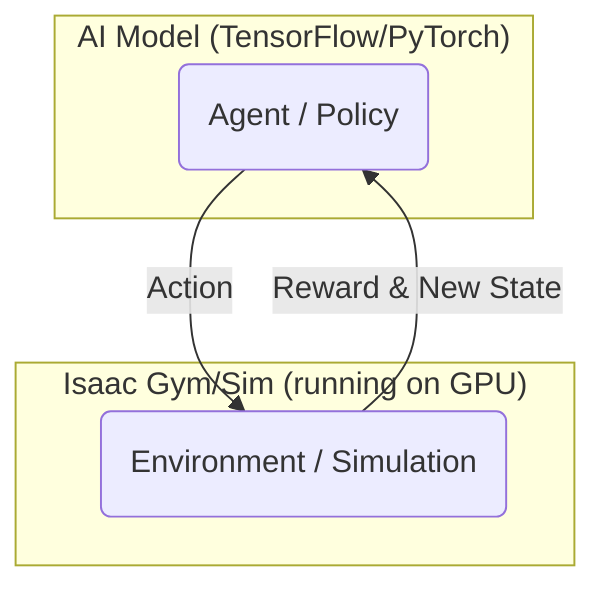

# Reinforcement Learning for Robot Control

## Overview
This chapter provides an introduction to applying Reinforcement Learning (RL) for robotics control tasks, particularly within the NVIDIA Isaac ecosystem. RL is a powerful paradigm where an "agent" learns to make optimal decisions by trial and error, receiving "rewards" or "penalties" for its actions. This is especially useful for tasks that are difficult to program explicitly.

## Learning Outcomes
- Understand the basic concepts of Reinforcement Learning (Agent, Environment, State, Action, Reward).
- Recognize the types of robotics problems where RL is a good fit.
- Learn about the role of simulation in training RL agents for robotics.
- Get introduced to NVIDIA's tools for robotics RL, such as Isaac Gym.

## Real-life example
Teaching a robot hand to reorient a cube is extremely complex to program with traditional methods due to the complex physics and contact forces. Instead, with RL, developers create a simulated environment (the "Environment") with the robot hand and cube. The AI model (the "Agent") tries millions of different finger movements ("Actions"). It receives a positive "Reward" every time the cube gets closer to the desired orientation. Over millions of trials in simulation, the agent learns a complex strategy to successfully manipulate the cube.

## Technical explanation with diagrams
The RL process is a loop. The agent observes the state of the environment, takes an action, and receives a reward and the new state. Its goal is to learn a "policy" – a mapping from states to actions – that maximizes its cumulative reward over time. Isaac Gym and Isaac Sim are powerful tools for this because they can run thousands of simulations in parallel on a single GPU, dramatically speeding up the learning process.


*Figure 1: The core loop of Reinforcement Learning.*

## Code examples (Conceptual RL Training Script)
```python
# Conceptual placeholder for an RL training script using Isaac Gym

import isaacgym

# 1. Initialize Isaac Gym
gym = isaacgym.acquire_gym()

# 2. Configure simulation parameters
sim_params = isaacgym.gymapi.SimParams()
# ... set up physics, gravity, etc.
sim = gym.create_sim(compute_device_id, graphics_device_id, type, sim_params)

# 3. Load assets (robot, objects to manipulate)
robot_asset = gym.load_asset(sim, "path/to/robot.urdf")
table_asset = gym.load_asset(sim, "path/to/table.urdf")

# 4. Create many parallel environments
num_envs = 4096
envs = []
for i in range(num_envs):
    env = gym.create_env(sim, lower, upper, num_per_row)
    # ... add robot and table to each environment
    envs.append(env)

# 5. Define the RL Agent (using a library like PyTorch)
policy = create_rl_agent()

# 6. Main training loop
while not done:
    # Get observations from all parallel environments
    obs = gym.fetch_observations(sim)
    
    # Let the agent decide on actions for all environments
    actions = policy.get_actions(obs)
    
    # Apply actions to all environments
    gym.set_dof_control_target_tensor(sim, actions)
    
    # Step the simulation
    gym.simulate(sim)
    gym.fetch_results(sim, True)
    
    # Calculate rewards and update the agent's policy
    rewards, resets = calculate_rewards()
    policy.update(obs, actions, rewards, resets)

```

## Glossary
- **Reinforcement Learning (RL)**: A machine learning paradigm where an agent learns to behave in an environment by performing actions and seeing the results.
- **Agent**: The learner or decision-maker in an RL problem.
- **Environment**: The external world in which the agent operates.
- **Reward**: A feedback signal that indicates how well the agent is doing.
- **Policy**: The strategy that the agent uses to select actions based on the current state.
- **Isaac Gym**: A high-performance physics simulation toolkit from NVIDIA, specifically designed for massively parallel reinforcement learning.

## Quiz Questions
1. In Reinforcement Learning, what is the "agent"?
    a) The physical robot hardware.
    b) The simulated world.
    c) The AI model that learns to make decisions.
    d) The human programmer.

2. What is the purpose of a "reward" signal in RL?
    a) To tell the agent which action to take.
    b) To provide feedback on how good or bad its last action was.
    c) To define the robot's physical limits.
    d) To end the simulation.

3. Why is massively parallel simulation (like in Isaac Gym) so beneficial for RL?

4. What is a "policy" in the context of RL?

5. Give an example of a robotics task that is well-suited for RL and explain why.
