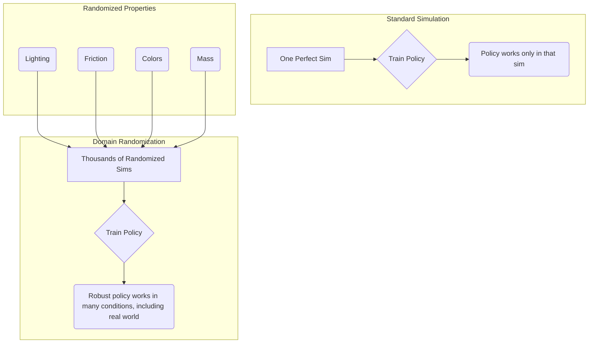

# Sim-to-Real Transfer

## Overview
This chapter tackles one of the most significant challenges in modern robotics: the "reality gap." An AI policy trained perfectly in simulation often fails when deployed on a physical robot because the simulation is not a perfect replica of the real world. We will explore the sim-to-real problem and discuss common techniques used to bridge this gap.

## Learning Outcomes
- Understand and define the "sim-to-real" problem or "reality gap."
- Learn about domain randomization as a technique to improve policy robustness.
- Understand the importance of accurate physics modeling and system identification.
- Recognize that sim-to-real is an active and challenging area of research.

## Real-life example
An RL agent is trained in Isaac Sim to pick up a specific type of screw. The simulation uses a perfect 3D model of the screw. When deployed on the real robot, the agent fails because the real screws have slight manufacturing defects, different reflective properties, and the robot's gripper has minor wear-and-tear not present in the simulation. The policy, having only ever seen the "perfect" world, cannot cope with these small differences.

## Technical explanation with diagrams
Domain Randomization is a key technique to combat the reality gap. Instead of training in one perfect simulation, you train the agent across thousands of slightly different simulations simultaneously. In each one, you randomize properties like lighting, object textures, friction, the robot's mass, and sensor noise. This forces the agent to learn a policy that is robust and can ignore irrelevant variations.


*Figure 1: Comparison between standard simulation and domain randomization.*

## Code examples (Conceptual Domain Randomization)
```python
# Conceptual placeholder for domain randomization in an Isaac Gym script

# ... (inside your environment creation loop) ...

for i in range(num_envs):
    env = gym.create_env(sim, lower, upper, num_per_row)
    
    # -- DOMAIN RANDOMIZATION --
    
    # Randomize robot properties
    dof_props = gym.get_actor_dof_properties(env, robot_handle)
    dof_props["stiffness"] *= random.uniform(0.8, 1.2)
    dof_props["damping"] *= random.uniform(0.8, 1.2)
    gym.set_actor_dof_properties(env, robot_handle, dof_props)
    
    # Randomize object color
    color = (random.random(), random.random(), random.random())
    gym.set_rigid_body_color(env, object_handle, 0, gymapi.MESH_VISUAL, color)

    # Randomize light properties
    light_props = gym.get_light_properties(sim, light_handle)
    light_props.intensity *= random.uniform(0.5, 1.5)
    gym.set_light_properties(sim, light_handle, light_props)
    
    # ... add actors to the environment
```

## Glossary
- **Sim-to-Real Transfer**: The process of taking a policy or model trained in a simulation and successfully deploying it on a physical system in the real world.
- **Reality Gap**: The discrepancy between a simulation and the real world, which can cause policies trained in simulation to fail on physical hardware.
- **Domain Randomization**: A technique used to improve sim-to-real transfer by training a policy in a wide variety of randomized simulation environments.
- **System Identification**: The process of building a mathematical model of a physical system by observing its behavior and measuring its properties (e.g., measuring the true mass and friction of a robot's joints).

## Quiz Questions
1. What is the "reality gap" in the context of robotics simulation?
    a) The time delay between the simulation and the real world.
    b) The difference in cost between a simulated robot and a real one.
    c) The collection of differences between the simulation and reality that causes policies to fail.
    d) A feature in Isaac Sim.

2. How does Domain Randomization help to bridge the reality gap?
    a) It makes the simulation run faster.
    b) It makes the simulation perfectly match one specific real-world robot.
    c) It forces the learned policy to be robust by exposing it to a wide range of conditions.
    d) It guarantees the policy will work in the real world.

3. Besides domain randomization, what is another important step for good sim-to-real transfer?

4. Why might a policy trained to see only red blocks in simulation fail to pick up a real red block under fluorescent lighting?

5. Is sim-to-real a solved problem in robotics?
