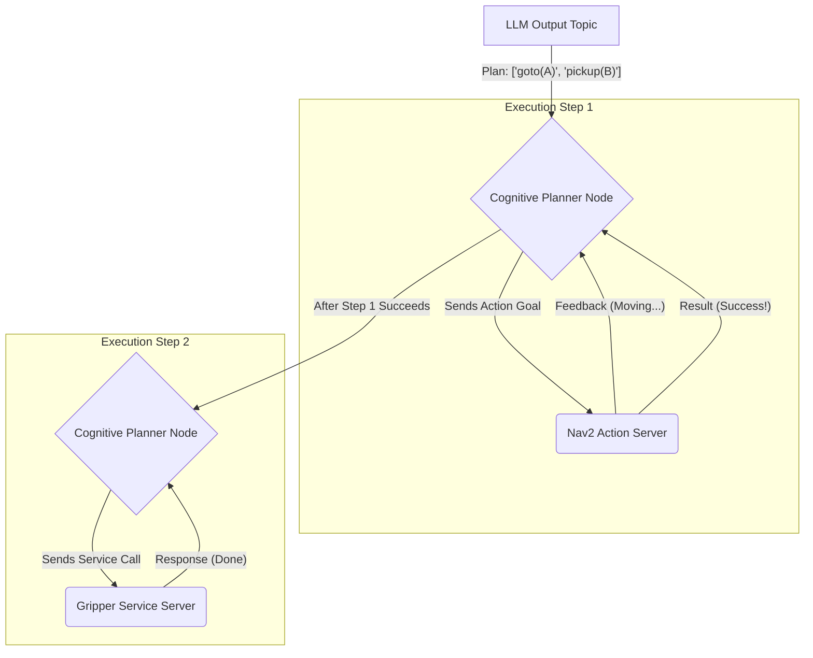

# Cognitive Planning: Natural Language to ROS 2 Actions

## Overview
This chapter bridges the gap between the high-level plan generated by an LLM and the low-level actions a robot needs to perform. We'll design a "cognitive planner" or "executor" node that takes a text-based plan (e.g., "1. Go to table, 2. Pick up apple") and translates it into a sequence of concrete ROS 2 service calls and action goals.

## Learning Outcomes
- Understand the need for a mid-level planner to execute LLM-generated plans.
- Learn how to parse a structured text plan into a machine-readable format.
- Design a system that maps plan steps to specific ROS 2 actions (like Nav2) or services.
- Manage the state of the plan execution (e.g., waiting for one action to complete before starting the next).

## Real-life example
The LLM has provided the plan: `["goto('kitchen')", "find('cup')", "pickup('cup')"]`. The cognitive planner receives this. It first identifies `goto('kitchen')`. It knows this maps to a `NavigateToPose` action in Nav2. It looks up the coordinates for "kitchen," constructs the action goal, and sends it. The planner then waits for Nav2 to report success. Only after the robot has reached the kitchen does the planner move to the next step, `find('cup')`, perhaps by calling a perception service.

## Technical explanation with diagrams
The Cognitive Planner acts as a state machine, executing one step of the plan at a time. It subscribes to the LLM's output and acts as a client for various ROS 2 action servers (like Nav2) and service servers (like a gripper controller).


*Figure 1: The Cognitive Planner executing a two-step plan sequentially.*

## Code examples (Conceptual Python/rclpy) 
```python
# Conceptual placeholder for a cognitive planner node

import rclpy
from rclpy.node import Node
from std_msgs.msg import String

# Assume we also import action clients for Nav2, etc.
# from nav2_msgs.action import NavigateToPose

class CognitivePlannerNode(Node):
    def __init__(self):
        super().__init__('cognitive_planner')
        self.plan = []
        self.current_step = 0
        
        # Subscribes to the plan generated by the LLM
        self.create_subscription(String, 'llm_plan', self.plan_callback, 10) 
        
        # Action clients for robot capabilities
        # self.nav_client = ActionClient(self, NavigateToPose, 'navigate_to_pose')
        
        self.get_logger().info('Cognitive Planner is ready.')

    def plan_callback(self, msg):
        """Receives a new plan and starts executing it."""
        if self.plan:
            self.get_logger().warn('Already executing a plan. Ignoring new one.')
            return
            
        self.get_logger().info(f'Received new plan: {msg.data}')
        # In a real system, you'd use a more robust parser
        self.plan = [step.strip() for step in msg.data.split('\n')]
        self.current_step = 0
        self.execute_step()

    def execute_step(self):
        """Executes the current step of the plan."""
        if not self.plan or self.current_step >= len(self.plan):
            self.get_logger().info('Plan execution complete.')
            self.plan = []
            return

        step = self.plan[self.current_step]
        self.get_logger().info(f'Executing step {self.current_step + 1}: {step}')
        
        # --- Simple Parser and Executor ---
        if step.startswith('goto'):
            # E.g., goto('kitchen')
            target = step.split("'`")[1]
            # self.send_nav_goal(target) -> This would call the nav client
            self.get_logger().info(f'SIMULATING: Navigation to {target}.')
            # In a real system, we'd wait for the action to finish
            # and call execute_step() again in the action's result callback.
            self.mock_action_finish()
            
        elif step.startswith('pickup'):
            # E.g., pickup('apple')
            target = step.split("'`")[1]
            # self.call_gripper_service('pickup', target)
            self.get_logger().info(f'SIMULATING: Picking up {target}.')
            self.mock_action_finish()

        else:
            self.get_logger().error(f'Unknown command in plan: {step}')
            self.plan = [] # Abort plan

    def mock_action_finish(self):
        """Simulates an action completing successfully."""
        self.current_step += 1
        self.execute_step()
```

## Glossary
- **Cognitive Planner/Executor**: A software module that translates high-level, abstract plans into low-level, concrete robot actions.
- **Action Client**: A ROS 2 entity that sends goals to an Action Server.
- **Action Server**: A ROS 2 entity that performs a long-running task, providing feedback and a final result. Nav2 is an example of an action server.

## Quiz Questions
1. What is the main responsibility of the "Cognitive Planner" node?
    a) To generate the high-level plan from a user's command.
    b) To convert a text-based plan into a sequence of ROS 2 actions and services.
    c) To directly control the robot's motors.
    d) To transcribe speech to text.

2. Why is it necessary to have this "middle layer" planner instead of having the LLM directly call ROS 2 actions?
    a) LLMs cannot make API calls.
    b) It decouples the LLM from the robot's specific control interface, making the system more modular.
    c) The cognitive planner is faster.
    d) ROS 2 actions are not written in Python.

3. In the diagram, how does the planner know that the `goto` action has finished successfully before it starts the `pickup` action?

4. What is the difference between a ROS 2 Action and a ROS 2 Service? Why would navigation be an Action?

5. What happens if the cognitive planner encounters a step in the plan it doesn't understand?
