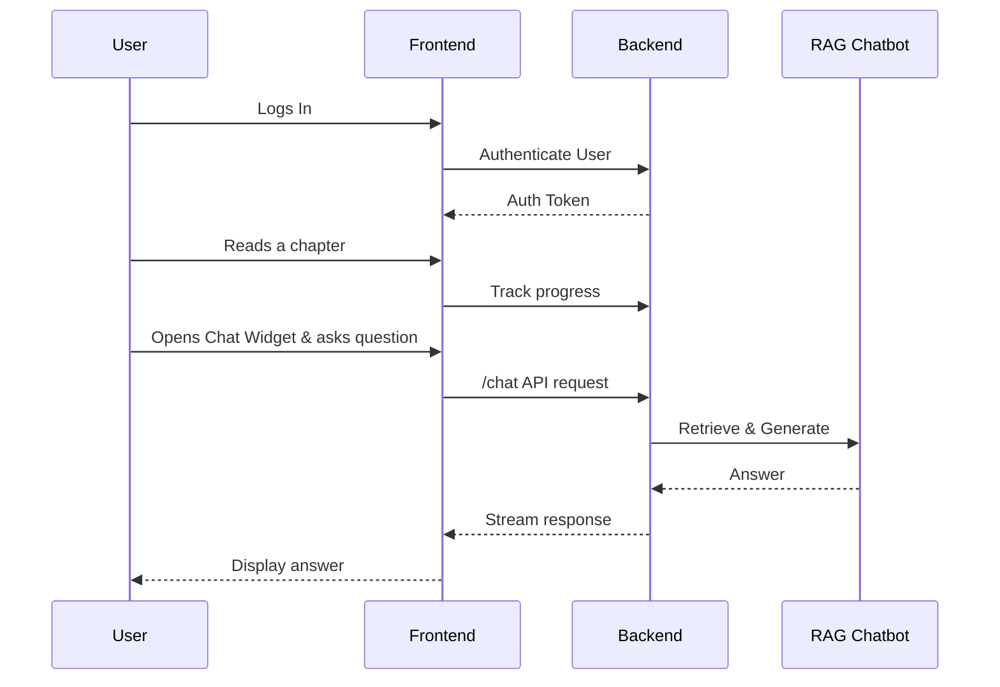

# Architecture: AI-Native Textbook Platform

This document describes the overall architecture of the "Physical AI & Humanoid Robotics" AI-native textbook platform, drawing from the project specification and implementation plan.

## 1. High-Level System Architecture

The system is designed with a modern, decoupled architecture to ensure scalability, maintainability, and a clear separation of concerns. It comprises a frontend application, a backend service, several AI/ML models, and dedicated data stores.

```mermaid
graph TD
    subgraph User Interface
        A[Docusaurus Frontend]
    end

    subgraph Backend Services
        B[FastAPI Backend]
    end

    subgraph Data Stores
        C[Neon Postgres DB]
        D[Qdrant Vector DB]
    end

    subgraph AI & ML Models
        E[Content Generation (Claude)]
        F[Embedding Model]
        G[RAG Chat Model]
        H[Translation Model (Urdu)]
    end

    A --"Chat, Auth, Personalization API Calls"--> B
    B --"User Data, Progress"--> C
    B --"Vector Search"--> D
    B --"RAG Inference"--> G
    B --"Translate Content"--> H

    subgraph Offline Processes
        I[Ingestion Pipeline]
    end

    I --"Generate/Load Content"--> E
    I --"Chunk & Embed"--> F
    I --"Store Embeddings"--> D

    style A fill:#cde4ff
    style B fill:#d2ffd2
    style C fill:#ffe4c4
    style D fill:#ffc4c4
    style E fill:#fcfcac
    style F fill:#fcfcac
    style G fill:#fcfcac
    style H fill:#fcfcac
    style I fill:#e6e6fa
```

### 1.1. System Components

*   **Frontend (Docusaurus):**
    *   **Description:** A static site generator for building the textbook interface, hosting educational content and a React-based chat widget.
    *   **Technologies:** Docusaurus, Next.js, Tailwind CSS, TypeScript.
    *   **Key Responsibilities:** Displaying textbook content, user authentication UI, personalization UI, chat widget, language switching.

*   **Backend (FastAPI):**
    *   **Description:** A Python-based API server handling business logic, user authentication, personalization, and orchestrating AI services.
    *   **Technologies:** FastAPI.
    *   **Key Responsibilities:** User authentication (`/login`, `/register`), progress tracking (`/progress`), RAG chatbot orchestration (`/chat`), translation service integration (`/translate`).

*   **Databases:**
    *   **Neon Postgres:**
        *   **Description:** A serverless Postgres database for structured data.
        *   **Key Data Stored:** User profiles, permissions, learning progress, chatbot conversations, chapters & modules.
        *   **Technologies:** Neon Postgres.
    *   **Qdrant Vector DB:**
        *   **Description:** A high-performance vector database for content embeddings.
        *   **Key Data Stored:** Text chunk embeddings from textbook content.
        *   **Technologies:** Qdrant Cloud.

*   **AI & ML Models:**
    *   **Content Generation (Claude):**
        *   **Description:** Used in an offline process to generate textbook chapters, code examples, and quizzes.
        *   **Technologies:** Claude API.
    *   **Embedding Model:**
        *   **Description:** Converts text chunks into vector embeddings for similarity search.
        *   **Technologies:** Models from Hugging Face (e.g., OpenAI Embeddings as per `spec.md` "OpenAI Agents / ChatKit").
    *   **RAG Chat Model:**
        *   **Description:** Generates answers based on user queries and retrieved context from the vector database.
        *   **Technologies:** OpenAI Agents/ChatKit.
    *   **Translation Model (Urdu):**
        *   **Description:** Provides English-to-Urdu translation for textbook content.
        *   **Technologies:** Dedicated model or API (specific one to be determined during implementation).

*   **Offline Processes:**
    *   **Ingestion Pipeline:**
        *   **Description:** Script to read Markdown files, chunk text, generate embeddings, and store them in Qdrant.

## 2. High-Level System & User Flow

### 2.1. User Flow



### 2.2. API Interactions

*   **Frontend to Backend:**
    *   `POST /auth/login`, `POST /auth/register`: User authentication.
    *   `POST /progress`: Track user learning progress (chapters viewed, quizzes completed).
    *   `POST /chat`: Send user queries to the RAG chatbot and receive responses.
    *   `POST /personalize`: Request personalized chapter content.
    *   `POST /translate`: Request chapter content translation.

*   **Backend to Databases:**
    *   **Neon Postgres:** Store/retrieve user data, learning progress, and chatbot conversation history.
    *   **Qdrant Vector DB:** Perform vector similarity searches to retrieve relevant content chunks for RAG.

*   **Backend to AI Models:**
    *   **RAG Chat Model:** Send user queries and retrieved context for answer generation.
    *   **Translation Model:** Send text for translation.

## 3. Key Data Models (Entities)

*   **User**: `user_id`, `username`, `email`, `password_hash`, `software_background`, `hardware_background`, `preferred_language`.
*   **Chapter**: `chapter_id`, `module_id` (FK), `title`, `content_english`, `content_urdu` (nullable), `content_personalized` (nullable), `overview`, `learning_outcomes`, `real_life_example`, `technical_explanation`, `code_examples`, `glossary`, `quiz_questions`.
*   **Module**: `module_id`, `title`, `order`.
*   **Chatbot Conversation**: `conversation_id`, `user_id` (FK), `chapter_id` (FK, nullable), `question`, `answer`, `source_text`, `timestamp`.
*   **Log**: `log_id`, `timestamp`, `level`, `message`, `context`.

## 4. Technical Stack Summary

*   **Frontend:** Docusaurus, Next.js, Tailwind CSS, TypeScript
*   **Backend:** FastAPI
*   **Database:** Neon Postgres
*   **AI/LLM:** Claude Code (for content generation), OpenAI Agents/ChatKit (for RAG chatbot)
*   **Vector DB:** Qdrant Cloud
*   **Deployment:** GitHub Pages / Vercel (Frontend), Railway / Render (Backend)

## 5. Design Decisions / ADRs

Key architectural decisions (to be documented separately in `adr_summary.md`):
1.  Content Generation Workflow
2.  Translation Strategy
3.  Chatbot Integration Method
