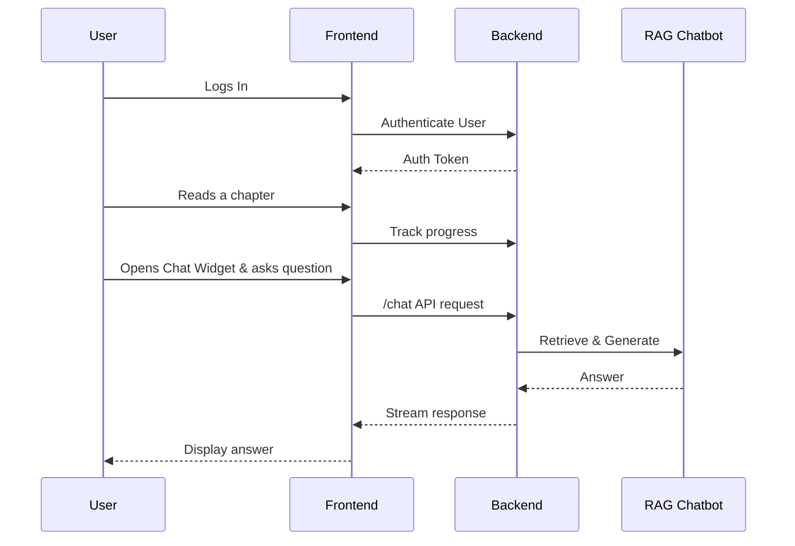

# AI-Native Textbook: Implementation Plan

This document outlines the implementation plan for the "Physical AI & Humanoid Robotics" AI-native textbook project.

## 1. Architecture Overview

The system is designed with a modern, decoupled architecture to ensure scalability, maintainability, and a clear separation of concerns.

### 1.1. System Organization

The architecture comprises a frontend application, a backend service, several AI/ML models, and dedicated data stores.

```mermaid
graph TD
    subgraph User Interface
        A[Docusaurus Frontend]
    end

    subgraph Backend Services
        B[FastAPI Backend]
    end

    subgraph Data Stores
        C[Neon Postgres DB]
        D[Qdrant Vector DB]
    end

    subgraph AI & ML Models
        E[Content Generation (Claude)]
        F[Embedding Model]
        G[RAG Chat Model]
        H[Translation Model (Urdu)]
    end

    A --"Chat, Auth, Personalization API Calls"--> B
    B --"User Data, Progress"--> C
    B --"Vector Search"--> D
    B --"RAG Inference"--> G
    B --"Translate Content"--> H

    subgraph Offline Processes
        I[Ingestion Pipeline]
    end

    I --"Generate/Load Content"--> E
    I --"Chunk & Embed"--> F
    I --"Store Embeddings"--> D

    style A fill:#cde4ff
    style B fill:#d2ffd2
    style C fill:#ffe4c4
    style D fill:#ffc4c4
    style E fill:#fcfcac
    style F fill:#fcfcac
    style G fill:#fcfcac
    style H fill:#fcfcac
    style I fill:#e6e6fa
```

- **Frontend (Docusaurus):** A static site generator for building the textbook interface. It will host the educational content and a React-based chat widget.
- **Backend (FastAPI):** A Python-based API server to handle business logic, including user authentication, personalization, and orchestrating the RAG chatbot and translation services.
- **Databases:**
    - **Neon Postgres:** A serverless Postgres database for storing structured data like user profiles, permissions, and learning progress.
    - **Qdrant:** A high-performance vector database to store and search content embeddings for the RAG chatbot.
- **AI Models:**
    - **Content Generation:** Claude API will be used in an offline process to generate the textbook's chapters, code examples, and quizzes.
    - **Embedding & RAG:** Models (e.g., from Hugging Face) for creating text embeddings and generating answers.
    - **Translation:** A dedicated model or API for English-to-Urdu translation.

### 1.2. High-Level System & User Flow

**User Flow:**



## 2. Implementation Phases

The project is broken down into five distinct phases, allowing for iterative development and clear milestones.

### Phase 1: Foundation & Core Content (Days 1-2)
- **Goal:** Establish the project structure and create the initial, static version of the textbook.
- **Tasks:**
    1. Initialize Git repository and project scaffolding for Docusaurus and FastAPI.
    2. Set up Neon Postgres and Qdrant cloud instances.
    3. Define database schemas (users, progress).
    4. Use Claude to generate content for the first 2-3 chapters.
    5. Manually integrate generated Markdown content, images, and code examples into Docusaurus.
    6. Basic styling and layout for the Docusaurus site.
- **Milestone:** A live, static version of the textbook with initial chapters is deployed.

### Phase 2: RAG Chatbot Implementation (Days 3-4)
- **Goal:** Implement and integrate the RAG chatbot.
- **Tasks:**
    1. Build the content ingestion pipeline: a script to read Markdown files, chunk text, generate embeddings, and store them in Qdrant.
    2. Develop a `/chat` endpoint in the FastAPI backend that orchestrates the RAG process.
    3. Create a simple, floating chat widget in the Docusaurus frontend (React component).
    4. Connect the chat widget to the backend API.
- **Milestone:** The chatbot is functional and can answer questions based on the content from Phase 1.

### Phase 3: User Authentication & Personalization (Days 5-6)
- **Goal:** Enable user accounts and basic personalization.
- **Tasks:**
    1. Integrate an authentication library (e.g., `fastapi-users`) into the backend.
    2. Create login, registration, and profile management pages/components in the frontend.
    3. Implement backend logic to track user progress (e.g., chapters viewed, quizzes completed).
    4. Add a "My Progress" section to the user profile page.
    5. **(Stretch)** Implement a basic recommendation engine (e.g., "Next Chapter to Read").
- **Milestone:** Users can create accounts, log in, and track their reading progress.

### Phase 4: Urdu Translation (Day 7)
- **Goal:** Add on-the-fly Urdu translation for the textbook content.
- **Tasks:**
    1. Create a `/translate` endpoint in the backend that calls a translation service.
    2. Add a language switcher to the Docusaurus navigation bar.
    3. Implement frontend logic to fetch and display the translated content when the user selects "Urdu".
    4. Cache translations to reduce API calls.
- **Milestone:** Users can read the textbook content in Urdu.

### Phase 5: Testing, Deployment, & Polish (Day 8)
- **Goal:** Ensure the application is stable, deployed, and user-friendly.
- **Tasks:**
    1. Conduct end-to-end testing of all features.
    2. Set up CI/CD pipelines for automated deployment.
    3. Deploy the Docusaurus frontend (e.g., Vercel) and FastAPI backend (e.g., Render).
    4. Final UI/UX review and polish.
- **Milestone:** The full-featured application is live and meets all success criteria.

## 3. Component Breakdown

- **Docusaurus Frontend:**
    - `src/pages`: Core pages (Home, Login).
    - `docs/`: Markdown files for each chapter.
    - `src/components/ChatWidget/`: React component for the chatbot.
    - `src/components/UserProfile/`: Components for the user profile and progress.
    - `i18n/`: Docusaurus internationalization integration (for static text).
- **FastAPI Backend:**
    - `routers/chat.py`: Chat endpoint.
    - `routers/auth.py`: User authentication endpoints.
    - `routers/progress.py`: Endpoints for tracking learning progress.
    - `services/rag.py`: RAG pipeline logic.
    - `services/translation.py`: Translation service wrapper.
    - `db/`: Database models and session management.
- **AI & Data:**
    - `scripts/ingest.py`: Offline script for content ingestion.
    - `generation/`: Prompts and scripts for Claude-based content generation.

## 4. Dependencies and Sequencing

- **Content must be generated (Phase 1) before the RAG pipeline can ingest it (Phase 2).**
- **The RAG backend must be complete (Phase 2) before the frontend chat widget can be fully integrated.**
- **User authentication (Phase 3) is a prerequisite for personalization.**
- **Parallel Work:**
    - Frontend styling and static page creation can proceed in parallel with backend API development.
    - The content generation and ingestion pipeline can be developed in parallel with the user authentication features.

## 5. Design Decisions / ADRs

Key architectural decisions are documented separately in `adr_summary.md`. These include:
1. Content Generation Workflow
2. Translation Strategy
3. Chatbot Integration Method

## 6. Testing & QA Strategy

- **Content:** Manual review of generated content for technical accuracy, clarity, and grammatical correctness.
- **RAG Chatbot:**
    - Create a test suite of 20-30 questions to evaluate response accuracy, relevance, and identify hallucinations.
    - Unit tests for the `ingest.py` script and RAG service components.
- **Personalization:** Integration tests to verify that user progress is correctly tracked and reflected.
- **Translation:** Manual review of translated snippets by a native Urdu speaker to check for quality and context.
- **Cross-Browser Testing:** Ensure the Docusaurus site functions correctly on major web browsers.

## 7. Success Criteria

The plan directly maps to the project's success criteria:
- **Functional RAG Chatbot:** Addressed in Phase 2.
- **Personalized Learning Experience:** Addressed in Phase 3.
- **Urdu Translation:** Addressed in Phase 4.
- **Comprehensive Content:** Addressed in Phase 1 and ongoing generation.
- **User-Friendly Interface:** Addressed across all phases, with a focus in Phase 5.
